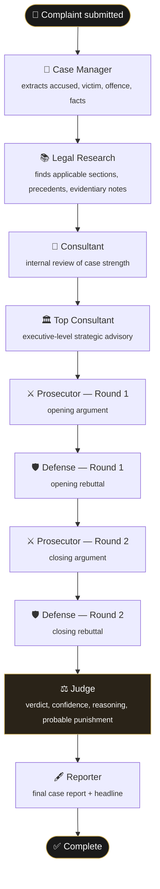
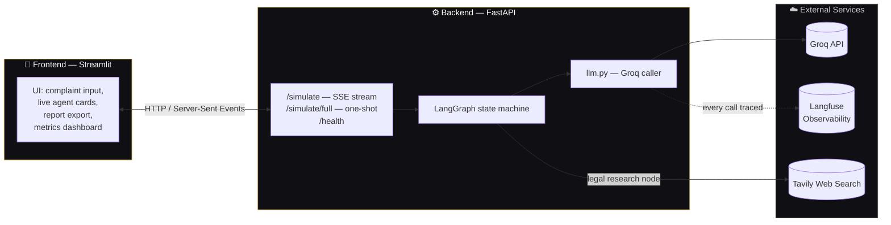
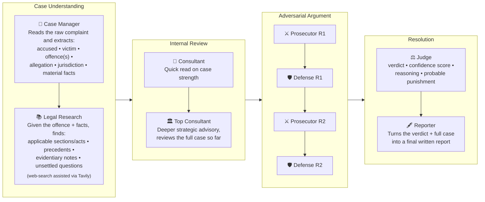
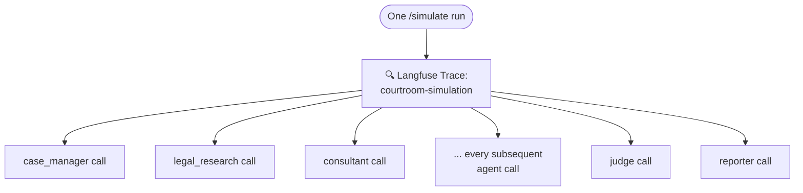

# ⚖️ Courtroom AI — Multi-Agent Legal Simulation

A multi-agent courtroom simulation, built on **LangGraph** and **Groq**, that takes a single case
complaint and runs it through a full adversarial legal proceeding — case intake, legal research,
internal strategy review, two rounds of prosecution vs. defense argument, a judge's verdict, and a
final report — with every step visible as it happens.

---

## How it works

You submit a **complaint / case brief**. It flows through a pipeline of specialized agents, each one
a focused LLM call that reads the accumulated case state and adds its own piece to it. Nothing is
generated in one shot — the case is built up incrementally, the same way a real proceeding unfolds.



Each box above is one node in a **LangGraph** state graph. The whole run streams live to the UI —
you see the Case Manager's findings appear, then Legal Research, then each argument round, then the
verdict — rather than waiting for one long blocking response.

### Two kinds of agent calls

| Type | Used by | What it returns |
|---|---|---|
| **Structured** | Case Manager, Legal Research, Judge | A JSON object validated against a Pydantic schema (e.g. `CaseIntake`, `LegalResearch`, `JudgeVerdict`) — reliable, typed fields the UI can render directly |
| **Prose** | Consultant, Top Consultant, Prosecutor, Defense, Reporter | Free-form written argument or narrative text |

---

## Architecture

The simulation logic and the UI are fully decoupled — the backend has no idea a Streamlit app
exists, and the frontend has no idea how a courtroom simulation actually runs.



- **Backend** (`backend/`) owns all simulation logic: the LangGraph pipeline, every agent's prompt,
  the Groq calls, and Langfuse tracing. It exposes a small HTTP API and knows nothing about how
  results get displayed.
- **Frontend** (`frontend/`) is a Streamlit app that posts a complaint to the backend, listens to the
  Server-Sent Events stream, and renders each agent's output as it arrives — plus a report
  export (PDF/Markdown) and a local evaluation dashboard.
- This split means the backend can be called from anything — a different UI, a CLI, another
  service — without touching agent logic.

---

## What each agent actually does



---

## Observability

Every single LLM call — which agent made it, the exact prompt, the response, latency, and token
usage — is automatically traced via **Langfuse**, with one parent trace per simulation run and each
agent's call nested underneath it. This is entirely separate from the in-app **Metrics** tab, which
scores a *finished* simulation on completeness, coherence, and legal accuracy using local
(non-LLM) heuristics — one tells you what happened during a run, the other tells you how good the
result was.



---

## Project structure

```
courtroom_simulation_api/
├── backend/                    FastAPI service — all simulation logic lives here
│   ├── main.py                   API routes, SSE streaming
│   ├── llm.py                    Groq API caller, Langfuse tracing
│   ├── config.py / config.yaml   per-agent model & call-type configuration
│   ├── agents/                   one file per agent
│   │   ├── case_manager.py
│   │   ├── legal_research.py
│   │   ├── consultant.py
│   │   ├── top_consultant.py
│   │   ├── prosecutor.py
│   │   ├── defense.py
│   │   ├── judge.py
│   │   ├── reporter.py
│   │   ├── web_search.py
│   │   └── schemas.py            Pydantic models (CaseIntake, LegalResearch, JudgeVerdict, ...)
│   └── graph/
│       ├── state.py              shared LangGraph state definition
│       └── graph.py               node wiring / pipeline order
└── frontend/                   Streamlit UI — talks to the backend over HTTP only
    ├── app.py                    complaint input, live simulation view, report export
    └── evaluation/                local, non-LLM scoring dashboard
```

---

## Running it locally

**Backend**
```bash
cd backend
pip install -r requirements.txt
cp .env.example .env   # fill in GROQ_API_KEY (and TAVILY_API_KEY for legal research)
uvicorn main:app --reload
```

**Frontend** (separate terminal)
```bash
cd frontend
pip install -r requirements.txt
streamlit run app.py
```

The frontend expects the backend at `http://127.0.0.1:8000` by default — override with the
`BACKEND_URL` environment variable if needed.

---

## Tech stack

| Layer | Tool |
|---|---|
| Agent orchestration | [LangGraph](https://github.com/langchain-ai/langgraph) |
| LLM inference | [Groq](https://groq.com) |
| Web search (legal research) | [Tavily](https://tavily.com) |
| Backend API | FastAPI + Server-Sent Events |
| Frontend | Streamlit |
| Observability | [Langfuse](https://langfuse.com) |
| Schema validation | Pydantic |